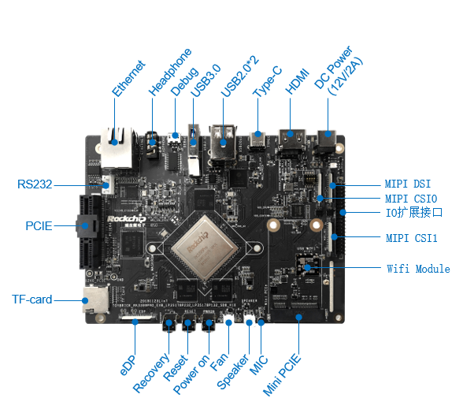
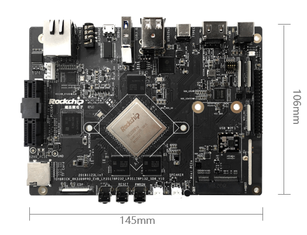
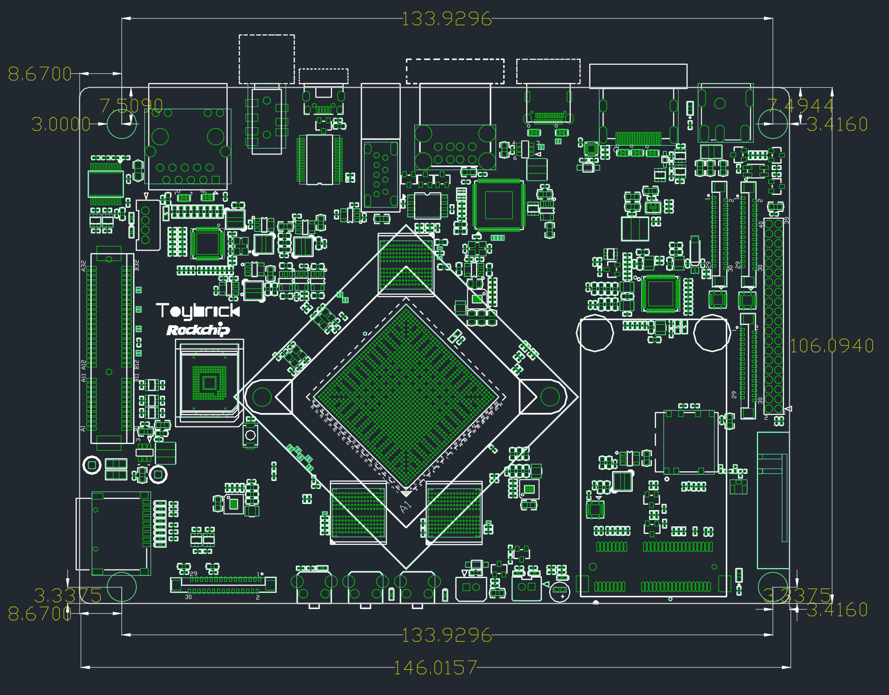

# Toybrick TB-RK3399ProD开发板

Toybrick RK3399Pro开发板是针对瑞芯微RK3399Pro芯片开发的集参考设计、芯片调试和测
试、芯片验证一体的硬件开发板，用于展示瑞芯微RK3399Pro芯片强大的多媒体接口和丰富的外
围接口，同时为开发者提供基于瑞芯微RK3399Pro芯片的硬件参考设计，使开发者不需修改或者
只需要简单修改参考设计的模块电路，就可以完成AI人工智能产品的硬件开发。

Toybrick RK3399Pro开发板支持RK3399Pro芯片的SDK开发、应用软件的开发和运行等。由
于接口齐全、设计具备较强拓展性，可应用不同使用场景、全功能验证。

---

## 相关站点

* 官网: <https://t.rock-chips.com/portal.php?mod=view&aid=4>
* 官方资料: <https://t.rock-chips.com/wiki.php>

## 尺寸图

---

## 目录

* [开发板信息](docs/开发板信息/开发板信息.md)
* [刷机指引](docs/刷机指引/刷机指引.md)
* [官方源代码](docs/官方源代码/官方源代码.md)
* [固件适配情况](docs/固件适配情况/固件适配情况.md)

---
