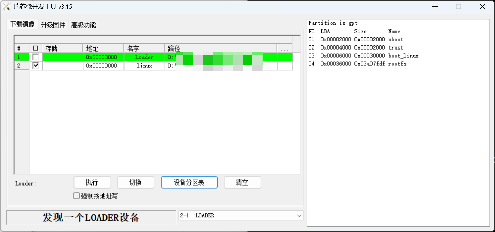
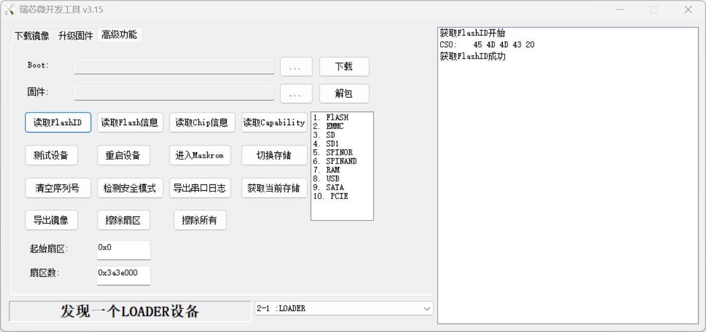
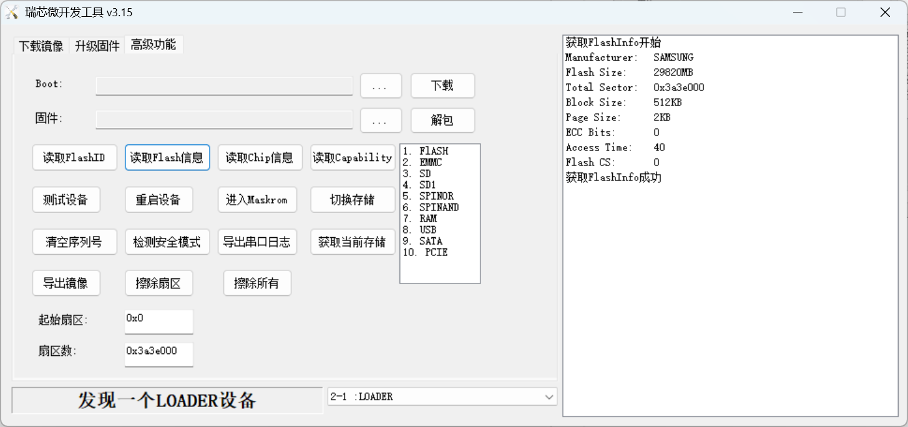
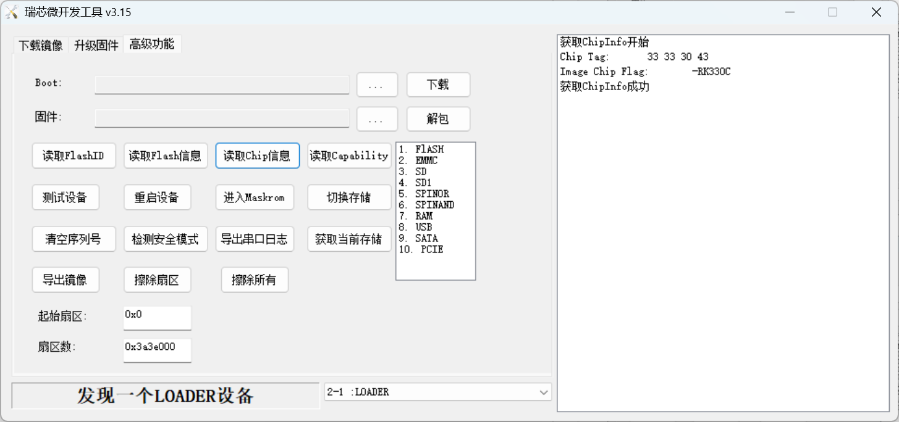
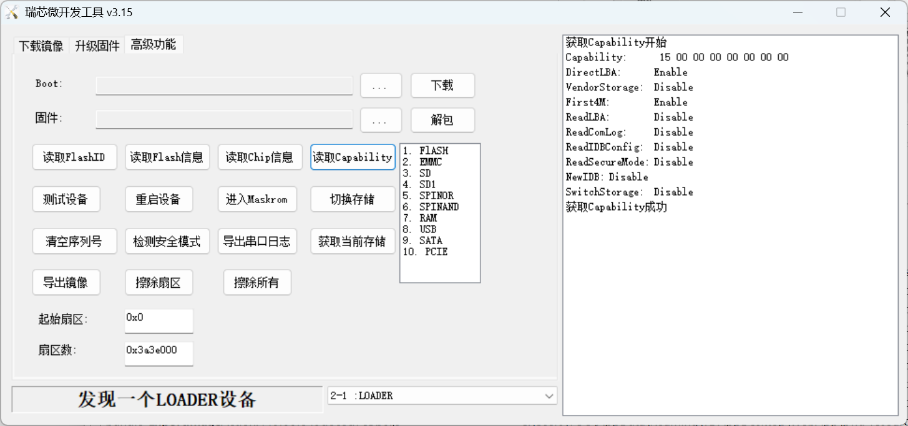
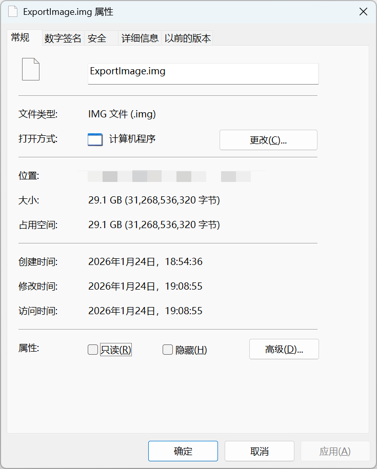
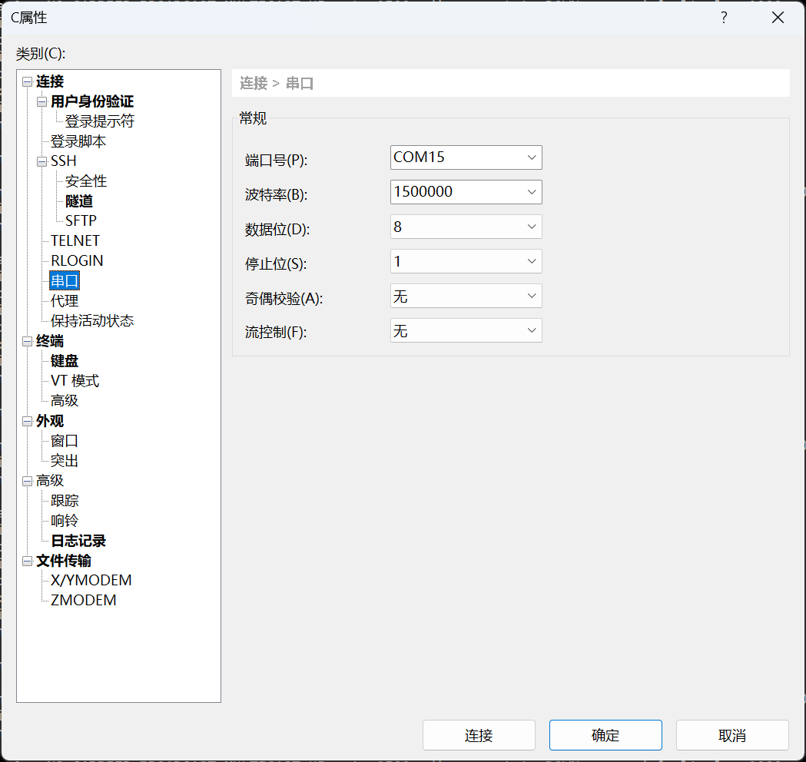
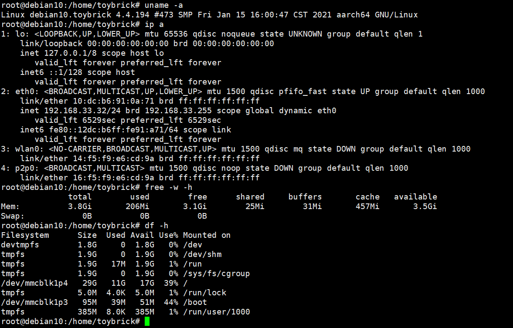
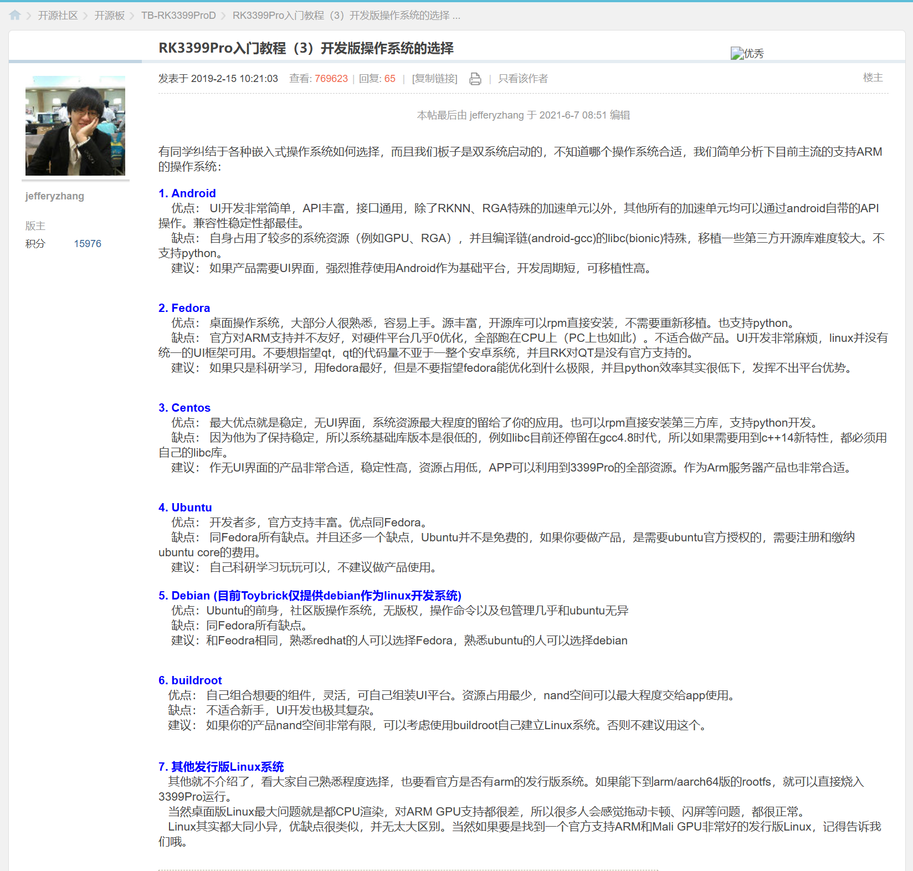

# 开发板信息

## rkdevtool可见信息











## 全盘备份

* RKDevTool_Release_v3.15
* 进入loader模式
* 起始扇区 0x 扇区数 0x3a3e000



## 修改系统密码

1. 接上microusb口，打串口驱动，串口链接，通信频率 1500000



2. 开机按ctrl+c，进入uboot命令行环境，执行下列命令。建议逐行拷贝粘贴（忽略#开头的行）

```shell
# 设置 bootargs（去掉 initramfs 相关，加 init=/bin/sh）
setenv bootargs 'storagemedia=emmc androidboot.mode=emmc earlycon=uart8250,mmio32,0xff1a0000 root=PARTUUID=614e0000-0000-4b53-8000-1d28000054a9 rw rootwait rootfstype=ext4 selinux=0 init=/bin/sh'

# 只加载内核和 dtb（不加载 initramfs）
load mmc 0:3  ${kernel_addr_r} /extlinux/Image
load mmc 0:3  ${fdt_addr_r} /extlinux/toybrick.dtb

# 启动时 **不传 initramfs**
booti  ${kernel_addr_r} -  ${fdt_addr_r}
```

3. 进入bash环境，执行passwd修改密码，重启后即可登陆。注意root密码不允许在ttl登陆，因此建议把toybrick用户的密码一并修改

直接修改密码:

```shell

# passwd
New password: 
Retype new password: 
passwd: password updated successfully
# 
# 
# cat /etc/passwd   
root:x:0:0:root:/root:/bin/bash
daemon:x:1:1:daemon:/usr/sbin:/usr/sbin/nologin
bin:x:2:2:bin:/bin:/usr/sbin/nologin
sys:x:3:3:sys:/dev:/usr/sbin/nologin
sync:x:4:65534:sync:/bin:/bin/sync
games:x:5:60:games:/usr/games:/usr/sbin/nologin
man:x:6:12:man:/var/cache/man:/usr/sbin/nologin
lp:x:7:7:lp:/var/spool/lpd:/usr/sbin/nologin
mail:x:8:8:mail:/var/mail:/usr/sbin/nologin
news:x:9:9:news:/var/spool/news:/usr/sbin/nologin
uucp:x:10:10:uucp:/var/spool/uucp:/usr/sbin/nologin
proxy:x:13:13:proxy:/bin:/usr/sbin/nologin
www-data:x:33:33:www-data:/var/www:/usr/sbin/nologin
backup:x:34:34:backup:/var/backups:/usr/sbin/nologin
list:x:38:38:Mailing List Manager:/var/list:/usr/sbin/nologin
irc:x:39:39:ircd:/var/run/ircd:/usr/sbin/nologin
gnats:x:41:41:Gnats Bug-Reporting System (admin):/var/lib/gnats:/usr/sbin/nologin
nobody:x:65534:65534:nobody:/nonexistent:/usr/sbin/nologin
_apt:x:100:65534::/nonexistent:/usr/sbin/nologin
systemd-timesync:x:101:102:systemd Time Synchronization,,,:/run/systemd:/usr/sbin/nologin
systemd-network:x:102:103:systemd Network Management,,,:/run/systemd:/usr/sbin/nologin
systemd-resolve:x:103:104:systemd Resolver,,,:/run/systemd:/usr/sbin/nologin
toybrick:x:1000:1000::/home/toybrick:/bin/bash
messagebus:x:104:110::/nonexistent:/usr/sbin/nologin
sshd:x:105:65534::/run/sshd:/usr/sbin/nologin
systemd-coredump:x:999:999:systemd Core Dumper:/:/usr/sbin/nologin
usbmux:x:106:46:usbmux daemon,,,:/var/lib/usbmux:/usr/sbin/nologin
rtkit:x:107:112:RealtimeKit,,,:/proc:/usr/sbin/nologin
speech-dispatcher:x:108:29:Speech Dispatcher,,,:/var/run/speech-dispatcher:/bin/false
geoclue:x:109:113::/var/lib/geoclue:/usr/sbin/nologin
pulse:x:110:115:PulseAudio daemon,,,:/var/run/pulse:/usr/sbin/nologin
avahi:x:111:118:Avahi mDNS daemon,,,:/var/run/avahi-daemon:/usr/sbin/nologin
saned:x:112:119::/var/lib/saned:/usr/sbin/nologin
lightdm:x:113:120:Light Display Manager:/var/lib/lightdm:/bin/false
dnsmasq:x:114:65534:dnsmasq,,,:/var/lib/misc:/usr/sbin/nologin
# 
# cat /etc/shadow	
root:$6$UrS4tfQtIDi1Fv2r$JLdSRnyjcUHNbYRuUVZ/AW9SuhS9pkxOlnVIv/W9R8dMNWSbQX/U2vGJkI7zYgkIzrCiSM4Q1SWZcfLXVbwah/:17383:0:99999:7:::
daemon:*:18181:0:99999:7:::
bin:*:18181:0:99999:7:::
sys:*:18181:0:99999:7:::
sync:*:18181:0:99999:7:::
games:*:18181:0:99999:7:::
man:*:18181:0:99999:7:::
lp:*:18181:0:99999:7:::
mail:*:18181:0:99999:7:::
news:*:18181:0:99999:7:::
uucp:*:18181:0:99999:7:::
proxy:*:18181:0:99999:7:::
www-data:*:18181:0:99999:7:::
backup:*:18181:0:99999:7:::
list:*:18181:0:99999:7:::
irc:*:18181:0:99999:7:::
gnats:*:18181:0:99999:7:::
nobody:*:18181:0:99999:7:::
_apt:*:18181:0:99999:7:::
systemd-timesync:*:18181:0:99999:7:::
systemd-network:*:18181:0:99999:7:::
systemd-resolve:*:18181:0:99999:7:::
toybrick:$6$5VlMK35uauWfIHgL$OxLKawFlPmc.d41qCfIMgIaRCC.WpqJzH6HfZKooXoU6goWc6zSmQRhRwQ5dqkVTPQkK4PmNTw8ckHldhQ30Q/:19677:0:99999:7:::
messagebus:*:18181:0:99999:7:::
sshd:*:18181:0:99999:7:::
systemd-coredump:!!:18186::::::
usbmux:*:18186:0:99999:7:::
rtkit:*:18186:0:99999:7:::
speech-dispatcher:!:18186:0:99999:7:::
geoclue:*:18186:0:99999:7:::
pulse:*:18186:0:99999:7:::
avahi:*:18186:0:99999:7:::
saned:*:18186:0:99999:7:::
lightdm:*:18186:0:99999:7:::
dnsmasq:*:18199:0:99999:7:::
# 

```

## debian10系统-开发板基本信息



分区情况

```shell
# blkid
/dev/mmcblk1: PTUUID="ee190000-0000-4c6d-8000-092500005db0" PTTYPE="gpt"
/dev/mmcblk1p1: PARTLABEL="uboot" PARTUUID="44340000-0000-4638-8000-49db00001076"
/dev/mmcblk1p2: PARTLABEL="trust" PARTUUID="e87e0000-0000-4f75-8000-62720000175f"
/dev/mmcblk1p3: UUID="8efce674-0a7f-4a76-bc32-8c116242dc5e" TYPE="ext2" PARTLABEL="boot_linux" PARTUUID="a2d37d82-51e0-420d-83f5-470db993dd35"
/dev/mmcblk1p4: UUID="a4030320-f5ca-4124-8a37-eaf1a564f446" TYPE="ext4" PARTLABEL="rootfs" PARTUUID="614e0000-0000-4b53-8000-1d28000054a9"

```

## debian10系统-引导方式

```shell
[root@debian10 /boot]# find .
.
./lost+found
./extlinux
./extlinux/toybrick-u2.dtb
./extlinux/toybrick.dtb
./extlinux/toybrick-edp.dtb
./extlinux/extlinux.conf
./extlinux/toybrick-default.dtb
./extlinux/toybrick-mipi.dtb
./extlinux/Image
./rescue.sh
./initramfs-toybrick-2.0.img
./toybrick.log
./toybrick-release

```

* uboot识别extlinux，读取 /extlinux/extlinux.conf 解析，加载内核 /extlinux/Image , 使用指定
  dtb文件 /extlinux/toybrick.dtb，使用initramfs文件 /initramfs-toybrick-2.0.img

```shell
[root@debian10 /boot]# cat extlinux/extlinux.conf 
label rockchip-kernel-4.4
	kernel /extlinux/Image
	fdt /extlinux/toybrick.dtb
	append  earlycon=uart8250,mmio32,0xff1a0000 initrd=/initramfs-toybrick-2.0.img root=PARTUUID=614e0000-0000-4b53-8000-1d28000054a9 rw rootwait rootfstype=ext4
```


## toybrick账号密码

TB-RK3399ProD、TB-96AI
预安装fedora28，Android 8.1系统。

fedora系统登录用户名：toybrick，密码：toybrick

a. 开机上电默认进入Linux系统。

b. 长按recovery按键，开机上电后：

（1）当type-c有接入时，进入loader模式；

（2）当type-c无接入时，进入Android系统；点击power on按钮可黑屏休眠，再次点击即可唤醒。

c. 用户若不需要双系统，或者觉得双系统占用太多空间，可以参考固件烧写章节单独烧写fedora28系统或单独烧写Android 8.1系统。




---